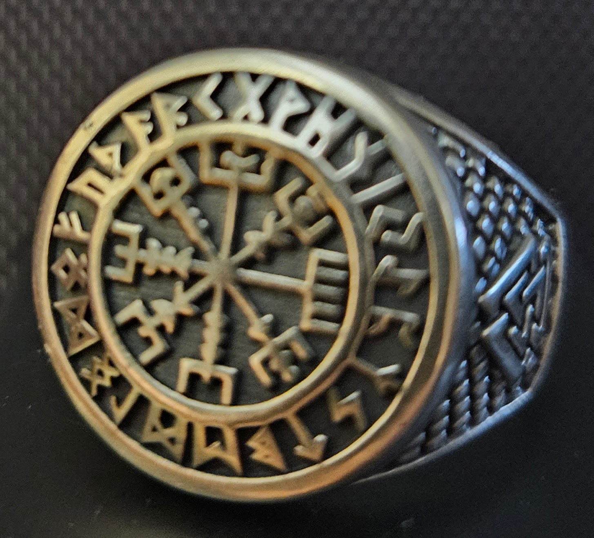

Race: Human 
Alignment: Chaotic Good 
🔮 Class: Cleric (City Domain) 
📚 Background: Academic (Occult Practices? {doesn't exist, just seems a better fit - no real benefits associated that I can see, just flavor}) 
🧭 Languages: Common, Undercommon, Ecclesiastical Latin, Abyssal or Infernal or Celestial or Primordial (an elemental language of the City?)? 
💰 Wealth: 8 (Middle-Class) 
⚔️ Starting Equipment: Collapsible Metal Baton, Soft Panel Vest, Pistol w/2 loaded mags, Explorer's Pack, Shield {I'd like to sell this}, Holy Symbol (ring)

---

<table class="char-table">
 <tbody>
  <tr>
   <td></td>
   <td class="small-header">total</td>
   <td class="small-header">mod</td>
   <td class="small-header">save</td>
   <td class="small-header">prof</td>
   <td class="small-header"> 🛠️ Languages, Proficiencies, Features</td>
  </tr>
  <tr>
   <td class="stat-name">STR</td>
   <td class="number">11</td>
   <td class="number">+0</td>
   <td class="number">+0</td>
   <td class="number"></td>
   <td rowspan=6 class="small-text">
    - Wealth: 8 (Middle-Class) 
    - Background: Academic (Occultism) 
    - Languages: Common, Undercommon, Ecclesiastical Latin, TBD 
    - Weapon Profs: Simple, Martial, Submachine Guns 
    - Armor Profs: Light, Medium, Shields 
    - Tool Profs: Forensics Kit, Herbalism Kit 
    - Other Profs: Vehicles (Land) 
    - City Domain: Heart of the City 
    - Background: Let Me Call an Expert
   </td>
  </tr>
  <tr>
   <td class="stat-name">DEX</td>
   <td class="number">13</td>
   <td class="number">+2</td>
   <td class="number">+2</td>
   <td class="number"></td>
  </tr>
  <tr>
   <td class="stat-name">CON</td>
   <td class="number">9</td>
   <td class="number">-1</td>
   <td class="number">-1</td>
   <td class="number"></td>
  </tr>
  <tr>
   <td class="stat-name">INT</td>
   <td class="number">14</td>
   <td class="number">+2</td>
   <td class="number">+2</td>
   <td class="number"></td>
  </tr>
  <tr>
   <td class="stat-name">WIS</td>
   <td class="number">16</td>
   <td class="number">+3</td>
   <td class="number">+5</td>
   <td class="number">x</td>
 </tr>
  <tr>
   <td class="stat-name">CHA</td>
   <td class="number">15</td>
   <td class="number">+2</td>
   <td class="number">+4</td>
   <td class="number">x</td>
 </tr>
 </tbody>
</table>

---

<table class="char-table">
 <tbody>
  <tr>
   <td colspan=7></td>
   <td colspan=10 class="small-header">🔮 spell slots per long rest</td>
  </tr>
  <tr>
   <td class="small-header">skill name</td>
   <td class="small-header">abil</td>
   <td class="small-header">total</td>
   <td class="small-header">stat</td>
   <td class="small-header">prof</td>
   <td class="small-header">other</td>
   <td rowspan=19></td>
   <td class="small-header">0th</td>
   <td class="small-header">1st</td>
   <td class="small-header">2nd</td>
   <td class="small-header">3rd</td>
   <td class="small-header">4th</td>
   <td class="small-header">5th</td>
   <td class="small-header">6th</td>
   <td class="small-header">7th</td>
   <td class="small-header">8th</td>
   <td class="small-header">9th</td>
  </tr>
  <tr>
   <td class="skill-name">Acrobatics</td>
   <td class="small-header">dex</td>
   <td class="number">2</td>
   <td class="small-header">2</td>
   <td class="small-header"></td>
   <td class="small-header"></td>
   <td class="small-header">-</td>
   <td class="small-header">-</td>
   <td class="small-header">-</td>
   <td class="small-header">-</td>
   <td class="small-header">-</td>
   <td class="small-header">-</td>
   <td class="small-header">-</td>
   <td class="small-header">-</td>
   <td class="small-header">-</td>
   <td class="small-header">-</td>
  </tr>
  <tr>
   <td class="skill-name">Animal Handling</td>
   <td class="small-header">wis</td>
   <td class="number">3</td>
   <td class="small-header">+3</td>
   <td class="small-header"></td>
   <td class="small-header"></td>
 </tr>
  <tr>
   <td class="skill-name">Arcana</td>
   <td class="small-header">int</td>
   <td class="number">2</td>
   <td class="small-header">+2</td>
   <td class="small-header"></td>
   <td class="small-header"></td>
  </tr>
  <tr>
   <td class="skill-name">Athletics</td>
   <td class="small-header">dex</td>
   <td class="number">2</td>
   <td class="small-header">+2</td>
   <td class="small-header"></td>
   <td class="small-header"></td>
   <td colspan=10 class="small-text"></td>
  </tr>
  <tr>
   <td class="skill-name">Deception</td>
   <td class="small-header">cha</td>
   <td class="number">2</td>
   <td class="small-header">+2</td>
   <td class="small-header"></td>
   <td class="small-header">c</td>
   <td colspan=10 class="small-text">1st Level: Heart of the City</td>
  </tr>
  <tr>
   <td class="skill-name">History</td>
   <td class="small-header">int</td>
   <td class="number">4</td>
   <td class="small-header">+2</td>
   <td class="small-header">x</td>
   <td class="small-header"></td>
   <td colspan=10 class="small-text"></td>
  </tr>
  <tr>
   <td class="skill-name">Insight</td>
   <td class="small-header">wis</td>
   <td class="number">5</td>
   <td class="small-header">+3</td>
   <td class="small-header">x</td>
   <td class="small-header">c</td>
   <td colspan=10 class="small-text">6th Level: Block Watch</td>
  </tr>
  <tr>
   <td class="skill-name">Intimidation</td>
   <td class="small-header">cha</td>
   <td class="number">2</td>
   <td class="small-header">+2</td>
   <td class="small-header"></td>
   <td class="small-header">c</td>
   <td colspan=10 class="small-text">1st Level: Heart of the City</td>
  </tr>
  <tr>
   <td class="skill-name">Investigation</td>
   <td class="small-header">int</td>
   <td class="number">2</td>
   <td class="small-header">+2</td>
   <td class="small-header"></td>
   <td class="small-header"></td>
  </tr>
  <tr>
   <td class="skill-name">Medicine</td>
   <td class="small-header">wis</td>
   <td class="number">3</td>
   <td class="small-header">+3</td>
   <td class="small-header"></td>
   <td class="small-header"></td>
  </tr>
  <tr>
   <td class="skill-name">Nature</td>
   <td class="small-header">int</td>
   <td class="number">2</td>
   <td class="small-header">+2</td>
   <td class="small-header"></td>
   <td class="small-header"></td>
   <td colspan=10 class="small-text"></td>
  </tr>
  <tr>
   <td class="skill-name">Perception</td>
   <td class="small-header">wis</td>
   <td class="number">3</td>
   <td class="small-header">+3</td>
   <td class="small-header"></td>
   <td class="small-header">c</td>
   <td colspan=10 class="small-text">6th Level: Block Watch</td>
  </tr>
  <tr>
   <td class="skill-name">Performance</td>
   <td class="small-header">cha</td>
   <td class="number">2</td>
   <td class="small-header">+2</td>
   <td class="small-header"></td>
   <td class="small-header"></td>
   <td colspan=10 class="small-text"></td>
  </tr>
  <tr>
   <td class="skill-name">Persuasion</td>
   <td class="small-header">cha</td>
   <td class="number">4</td>
   <td class="small-header">+2</td>
   <td class="small-header">x</td>
   <td class="small-header">c</td>
   <td colspan=10 class="small-text">1st Level: Heart of the City</td>
  </tr>
  <tr>
   <td class="skill-name">Religion</td>
   <td class="small-header">int</td>
   <td class="number">4</td>
   <td class="small-header">+2</td>
   <td class="small-header">x</td>
   <td class="small-header"></td>
  </tr>
  <tr>
   <td class="skill-name">Sleight of Hand</td>
   <td class="small-header">dex</td>
   <td class="number">2</td>
   <td class="small-header">+2</td>
   <td class="small-header"></td>
   <td class="small-header"></td>
  </tr>
  <tr>
   <td class="skill-name">Stealth</td>
   <td class="small-header">dex</td>
   <td class="number">2</td>
   <td class="small-header">+2</td>
   <td class="small-header"></td>
   <td class="small-header"></td>
  </tr>
  <tr>
   <td class="skill-name">Survival</td>
   <td class="small-header">wis</td>
   <td class="number">3</td>
   <td class="small-header">+3</td>
   <td class="small-header"></td>
   <td class="small-header"></td>
  </tr>
 </tbody>
</table>

---

### 🧑‍💼 BACKGROUND & IDENTITY

Formerly a teacher of occult practices for higher-level clergy in a related reilgious tradition, but stumbled upon some arcane knowledge and decided he needed to be doing street-level work and was directed to The CDG - which takes on other tasks like exorcisms, INSERT OTHER APPROPRIATE IN-GAME TASKS HERE.

{: width="25%" }

☦️ <b>The Church of Divine Guidance</b> 
 <ul>
  <li> <i>About:</i> This church is centered on one core theological principle: divine direction. It teaches that the Divine offers guidance through the storms of life — metaphorically mirrored in the Vegvísir runic compass — while honoring the belief that true goodness can only exist through free will (acknowledging that "good without free will is slavery"). The church itself is affiliated with Western Christian Traditions as a political matter, but they're more non-denominational in nature. Borrows heavily from multiple religious and philosophical ideas.</li>
  <li> <i>How it influences Marcus:</i> As a Chaotic Good urban minister, Marcus rejects rigid municipal or ecclesiastical bureaucracy. He follows his own conscience and street-level instincts to protect the city's citizenry, using his academic connections, street contacts, and technomagic to serve his community directly.</li>
  <li> <i>Holy Symbol:</i> Ring with Vegsivir, Futhark Runes, Valknuts</li>
  <li> <i>Deity:</i> The Divine as a title and not any specific name.</li>
  <li> <i>Holy Figures / Patron Saints:</i> Savras, god of divination and fate, Selûne, goddess of the moon, St. John of the Cross, Meister Eckhart, Friedrich Nietzsche {needs write-up}</li>
  <li> <i>Ecclesiastical Latin:</i> This is the style of the Latin language used by the Christian Church, characterized by Italian-style pronunciation, Christian-specific vocabulary, and simpler or scholastic grammar. It serves as the primary language for Catholic liturgies, papal documents, and historical theological texts.</li>
 </ul>

### 📊 Leveling Up

##### 1st-Level
- Racial (Human): All Abilities +1. Common & +1 Language (Undercommon for talking to shady types). Medium-sized. Speed 30ft.
- Class (Cleric): d8, Proficiencies, Insight, Persuasion
- Sub-Class (Cleric Modern): +Prof Submachine Guns & Martial Weapons & Vehicles (Land), Heart of the City
- Background (Academic): Religion, History, Let Me Call an Expert

##### 2nd-Level
- Class (Cleric / Modern): Channel Divinity (Turn Undead, Spirits of the City) [1/rest]

##### 3rd-Level
- Class (Cleric / Modern): 2nd Level Spell Slots

##### 4th-Level
- Class (Cleric / Modern): Ability Scores CON +1 [10] & STR +1 [12] {DEX & CHA at 8th}

##### 5th-Level
- Class (Cleric / Modern): 3rd Level Spell Slots, Destroy Undead (this might be Legacy which is good, but the PHB now lists Sear Undead)

### References
- [Cleric PHB](https://www.dndbeyond.com/sources/dnd/br-2024/character-classes#Cleric)
- [Modern Manual](https://homebrewery.naturalcrit.com/share/E9W-mVroT_p8#p97)
- [Academic Background](https://homebrewery.naturalcrit.com/share/E9W-mVroT_p8)
    - When I was looking at Faction Agent, it suggested I leverage Acolyte for the below, so I kept those.
    - Trait (from Acolyte in PHB): I am tolerant of other faiths and respect the worship of other gods.
    - Ideal (from Acolyte in PHB): Charity. I always try to help those in need, no matter what the personal cost. (Good) or Change. We must help bring about the changes the gods are constantly working in the world. (Chaotic) {maybe both?}
    - Bond (from Acolyte in PHB): Everything I do is for the common people.
    - Flaw (from Acolyte in PHB): I am suspicious of strangers and expect the worst of them.
- [Savras](https://forgottenrealms.fandom.com/wiki/Savras)
- [Selûne](https://forgottenrealms.fandom.com/wiki/Selûne)