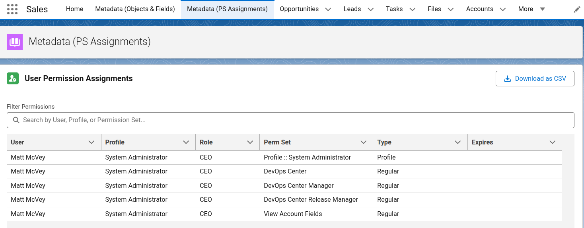

---
tags:
  - Apex
  - Javascript
  - LWC
  - Salesforce
---

## Display a User Permission Set Assignments via LWC



#### The actual SOQL
```sql
SELECT Id, PermissionSetGroupID, PermissionSetId, PermissionSet.Type, PermissionSet.Label, Assignee.Id, Assignee.Name, Assignee.Email,  Assignee.Profile.Name, Assignee.UserRole.Name
FROM PermissionSetAssignment 
WHERE Assignee.IsActive = TRUE 
   AND IsRevoked = FALSE
   AND Assignee.Profile.UserLicense.LicenseDefinitionKey = 'SFDC'
```

#### Apex Class

??? tip "PermissionManagementController"
        public with sharing class PermissionManagementController {
            
            @AuraEnabled(cacheable=true)
            public static List<PermissionWrapper> getPermissionAssignments() {
                List<PermissionWrapper> results = new List<PermissionWrapper>();
                
                try {
                    // Updated SOQL with your specific filters
                    for (PermissionSetAssignment psa : [
                        SELECT Id, 
                            PermissionSetId, 
                            PermissionSet.Type, 
                            PermissionSet.Label, 
                            ExpirationDate, 
                            Assignee.Id,
                            Assignee.Name, 
                            Assignee.Email, 
                            Assignee.Profile.Name, 
                            Assignee.UserRole.Name,
                            Assignee.IsActive
                        FROM PermissionSetAssignment 
                        WHERE Assignee.IsActive = TRUE 
                        AND IsRevoked = FALSE
                        AND Assignee.Profile.UserLicense.LicenseDefinitionKey = 'SFDC'
                        ORDER BY Assignee.Name ASC 
                        LIMIT 25000
                    ]) {
                        results.add(new PermissionWrapper(psa));
                    }
                } catch (Exception e) {
                    throw new AuraHandledException('Error fetching permissions: ' + e.getMessage());
                }
                
                return results;
            }

            /**
            * Wrapper class to organize data for the LWC Data Table
            */
            public class PermissionWrapper {
                @AuraEnabled public String userName;
                @AuraEnabled public String userEmail;
                @AuraEnabled public String userProfile;
                @AuraEnabled public String userRole;
                @AuraEnabled public String permSetLabel;
                @AuraEnabled public String permSetType;
                @AuraEnabled public Datetime expirationDate; 

                public PermissionWrapper(PermissionSetAssignment psa) {
                    // Basic User Information
                    this.userName = psa.Assignee.Name;
                    this.userEmail = psa.Assignee.Email;
                    this.userProfile = psa.Assignee.Profile.Name;
                    
                    // Handle null roles safely
                    this.userRole = (psa.Assignee.UserRole != null) ? psa.Assignee.UserRole.Name : 'N/A';
                    
                    this.permSetType = psa.PermissionSet.Type;
                    this.expirationDate = psa.ExpirationDate;

                    // THE "IF" LOGIC:
                    // If the Type is 'Profile', we label it as such using the Profile Name.
                    // Otherwise, we use the standard Permission Set Label.
                    if (psa.PermissionSet.Type == 'Profile') {
                        this.permSetLabel = 'Profile :: ' + psa.Assignee.Profile.Name;
                    } else {
                        this.permSetLabel = psa.PermissionSet.Label;
                    }
                }
            }
        }

#### Apex Test Class

??? tip "PermissionManagementControllerTest.cls"
        @isTest
        private class PermissionManagementControllerTest {
            @isTest
            static void testGetAssignments() {
                // PermissionSetAssignments are setup objects, but we can query them in tests
                Test.startTest();
                List<PermissionManagementController.PermissionWrapper> results = 
                    PermissionManagementController.getPermissionAssignments();
                Test.stopTest();
                
                // Assertions
                Assert.isNotNull(results, 'The list should not be null');
            }
        }


#### LWC - PermSet Assignments Javascript

??? tip "permSetExporter.js"
        import { LightningElement, wire, track } from 'lwc';
        import getPermissionAssignments from '@salesforce/apex/PermissionManagementController.getPermissionAssignments';

        const COLUMNS = [
            { label: 'User', fieldName: 'userName', type: 'text', sortable: true },
            { label: 'Profile', fieldName: 'userProfile', type: 'text' },
            { label: 'Role', fieldName: 'userRole', type: 'text' },
            { label: 'Perm Set', fieldName: 'permSetLabel', type: 'text' },
            { label: 'Type', fieldName: 'permSetType', type: 'text' },
            { 
                label: 'Expires', 
                fieldName: 'expirationDate', 
                type: 'date', 
                typeAttributes: {
                    year: 'numeric',
                    month: 'short',
                    day: '2-digit'
                }
            }
        ];

        export default class PermSetExporter extends LightningElement {
            @track data = [];         // Master list from Apex
            @track searchTerm = '';   // Current search text
            columns = COLUMNS;

            @wire(getPermissionAssignments)
            wiredData({ error, data }) {
                if (data) {
                    this.data = data;
                }
            }

            // This Getter automatically recalculates whenever data or searchTerm changes
            get filteredData() {
                if (!this.searchTerm) {
                    return this.data;
                }
                
                const s = this.searchTerm.toLowerCase();
                
                return this.data.filter(item => {
                    return (
                        (item.userName && item.userName.toLowerCase().includes(s)) ||
                        (item.userProfile && item.userProfile.toLowerCase().includes(s)) ||
                        (item.permSetLabel && item.permSetLabel.toLowerCase().includes(s))
                    );
                });
            }

            get isDownloadDisabled() {
                return !this.filteredData || this.filteredData.length === 0;
            }

            handleSearchChange(event) {
                this.searchTerm = event.target.value;
            }

            downloadCSV() {
                // We export the FILTERED list, so you only get what you see on screen
                const exportList = this.filteredData;
                if (exportList.length === 0) return;

                const headers = ['User', 'Email', 'Profile', 'Role', 'Perm Set', 'Type', 'Expiration'];
                let csvContent = headers.join(',') + '\n';
                
                exportList.forEach(row => {
                    const line = [
                        `"${row.userName || ''}"`,
                        `"${row.userEmail || ''}"`,
                        `"${row.userProfile || ''}"`,
                        `"${row.userRole || ''}"`,
                        `"${row.permSetLabel || ''}"`,
                        `"${row.permSetType || ''}"`,
                        `"${row.expirationDate || ''}"`
                    ];
                    csvContent += line.join(',') + '\n';
                });

                this.executeDownload(csvContent, 'Filtered_User_Permissions.csv');
            }

            executeDownload(csvContent, fileName) {
                const base64Data = btoa(unescape(encodeURIComponent(csvContent)));
                const link = document.createElement('a');
                link.href = 'data:text/csv;base64,' + base64Data;
                link.download = fileName;
                document.body.appendChild(link);
                link.click();
                document.body.removeChild(link);
            }
        }


#### LWC - PermSet Assignments HTML

??? tip "permSetExporter.html"
        <template>
            <lightning-card title="User Permission Assignments" icon-name="standard:user_role">
                <lightning-button 
                    slot="actions" 
                    label="Download as CSV" 
                    icon-name="utility:download" 
                    onclick={downloadCSV}
                    disabled={isDownloadDisabled}>
                </lightning-button>

                <div class="slds-var-p-around_medium">
                    <lightning-input 
                        type="search" 
                        label="Filter Permissions" 
                        placeholder="Search by User, Profile, or Permission Set..." 
                        onchange={handleSearchChange}
                        class="slds-var-m-bottom_small">
                    </lightning-input>

                    <div style="height: 450px;">
                        <lightning-datatable
                            key-field="id"
                            data={filteredData}
                            columns={columns}
                            hide-checkbox-column="true">
                        </lightning-datatable>
                    </div>
                    
                    <div class="slds-var-m-top_x-small slds-text-color_weak slds-text-body_small">
                        Showing {filteredData.length} of {data.length} assignments
                    </div>
                </div>
            </lightning-card>
        </template>

