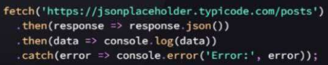
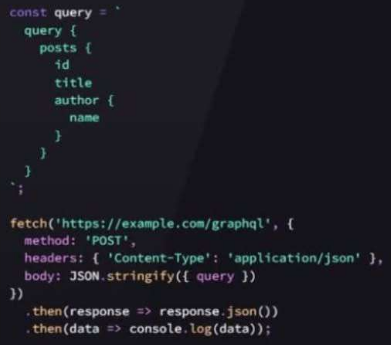
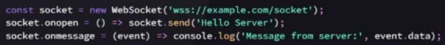

# Types of APIs
###### - From Renga Technologies
APIs :: Application Program Interfaces

### REST API
Representational State Transfer
- When you need a simple, stateless API that works well with HTTP methods
- Best for CRUD (Create, Read, Update, Delete)
- Simple, flexible, widely supported, highly scalable
 

### SOAP API
Simple Object Access Protocol
- When you need strict standards and high security
- Ideal for financial services, payment gateways, enterprise-level applications, legacy systems
- Requires more setup but more security and reliability
  

### GraphQL API
Graph Query Language
- When you need more control over the data you fetch
- Great for apps with complex data relationships
- Perfect for apps with evolving data structure or dynamic data sources
  

### WebSocket API
Real-time, two-way communication over a persistent connection
- When you need real-time communication, like in chat apps or live updates
- Ideal for apps that require low latency and continuous data flow
  
